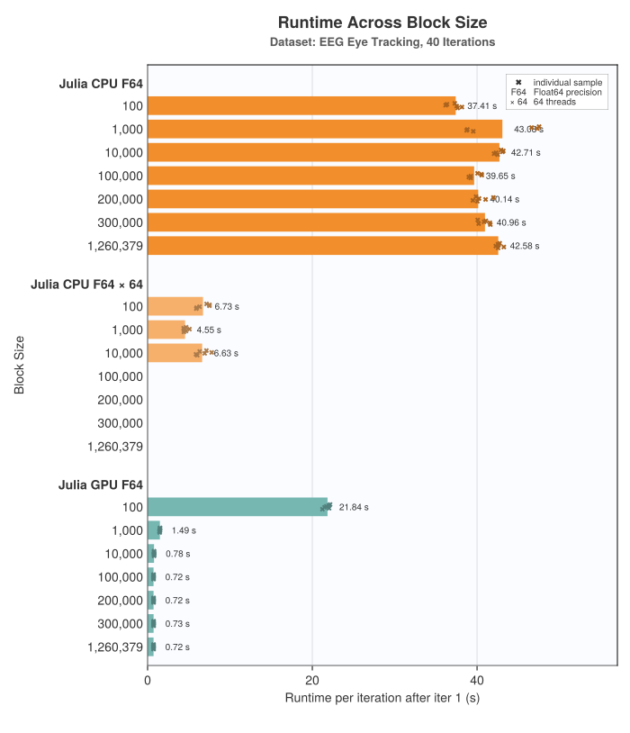

# Performance

## Choosing a Block Size

To achieve decent performance, setting an appropriate block size is essential. The block size determines in how many blocks a dataset is split for processing, and thereby influences the amount of memory that's allocated. The relationship to memory use is approximately `block_size * thread_count`.

In general, the algorithm's runtime is independent of the block size. However, the following two edge cases must be considered:

- When using a GPU backend, the block size limits the number of GPU threads. Therefore, a sufficiently large block size should be chosen, experience shows that values > 10,000 perform well
- When using multithreading on the CPU, the number of blocks (`n_samples / block_size`) must be greater or equal the number of threads, as threads will run idle otherwise but there will still be (potentially huge) allocations per idle thread.

Using multithreading and a GPU backend should be avoided, the GPU already parallelizes the computation so adding multithreading on top will bring no benefit but might introduce additional overhead.

(the chart omits configurations with less blocks than threads)

## Choosing a Thread Count

Increasing thread count effectively reduces runtime, given a sufficient number of CPU cores, but benchmarks have shown that results diminish around 16 threads. It might therefore be more efficient to choose a smaller number of threads and instead run multiple AMICAs in parallel.
